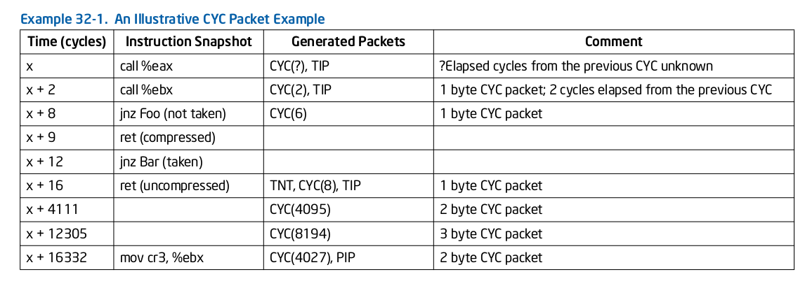
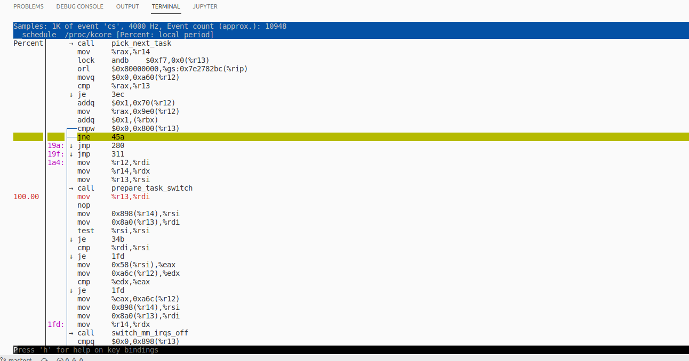

# intel-pt


intel processor trace is a hardware feature to record the program execution by encoding packet periodically.

control flow tracing packets:
- timing, 
- program flow information (e.g. branch targets, branch taken/not taken indications) and 
- program-induced mode related information (e.g. Intel TSX state transitions, CR3 changes).

Intel PT can also be configured to log software-generated packets using PTWRITE

```
 Intel Processor Trace (0x14):
      IA32_RTIT_CR3_MATCH is accessible      = true
      configurable PSB & cycle-accurate      = true
      IP & TraceStop filtering; PT preserve  = true
      MTC timing packet; suppress COFI-based = true
      PTWRITE support                        = true
      power event trace support              = false
      PSB/PMI preservation support           = true
      ToPA output scheme support             = true
      ToPA can hold many output entries      = true
      single-range output scheme support     = true
      output to trace transport              = false
      IP payloads have LIP values & CS       = false
      configurable address ranges            = 0x2 (2)
      supported MTC periods bitmask          = 0x249 (585)
      supported cycle threshold bitmask      = 0x3f (63)
      supported config PSB freq bitmask      = 0x3f (63)
```

## Cycle Count (CYC) packets

Cycle Count (CYC) packets: CYC packets provide indication of the number of processor core clock cycles that pass between packets.

> 32.3.6
>> Cycle-Accurate Mode
>> Intel PT can be run in a cycle-accurate mode which enables CYC packets (see Section 32.4.2.14) that provide low-
>> level information in the processor core clock domain. This cycle counter data in CYC packets can be used to
>> compute IPC (Instructions Per Cycle), or to track wall-clock time on a fine-grain level.

CYC packet appears with other packets, time updated until the new packet()



## generation frequency of per CYC packet

- CYC packet: store the timestamp to the last CYC.
- CYC-eligible packets:TNT, TIP, TIP.PGE, TIP.PGD, MODE.EXEC, MODE.TSX, PIP, VMCS, OVF, MTC, TSC, PTWRITE, EXSTOP

With this, all CYC-eligible packets will be preceded by a CYC packet, the payload of which indicates the number of core clock cycles since the last CYC packet. 

In cases where multiple CYC-eligible packets are generated in a single cycle, only a single CYC will be generated before the CYC-eligible packets, otherwise each CYC-eligible packet will be preceded by its own CYC. 


## challenges

- code range: filter
      * 35.2.4.1 Filtering by Current Privilege Level (CPL)
      * 35.2.4.2 Filtering by CR3
      * 35.2.4.3 Filtering by IP
            IA32_RTIT_ADDRn_A defines the base and IA32_RTIT_ADDRn_B specifies the limit of the range in which tracing is enabled.
- CYC record: trace enable, 
- packet get: ?
- packet decode: ?

## linux control the intel pt

https://elixir.bootlin.com/linux/v5.15/source/tools/perf/Documentation/perf-intel-pt.txt

sysfs to control the intel pt

```
$ grep -H . /sys/bus/event_source/devices/intel_pt/format/*
	/sys/bus/event_source/devices/intel_pt/format/cyc:config:1
	/sys/bus/event_source/devices/intel_pt/format/cyc_thresh:config:19-22
	/sys/bus/event_source/devices/intel_pt/format/mtc:config:9
	/sys/bus/event_source/devices/intel_pt/format/mtc_period:config:14-17
	/sys/bus/event_source/devices/intel_pt/format/noretcomp:config:11
	/sys/bus/event_source/devices/intel_pt/format/psb_period:config:24-27
	/sys/bus/event_source/devices/intel_pt/format/tsc:config:10

```


## perf test

**attension**

sampling new_slab:

```bash
sudo perf record -m,64M --kcore -e intel_pt/cyc,cyc_thresh=0/k --filter 'filter new_slab' -a
sudo perf script --insn-trace --xed -F-dso,-comm,-tid,+flags,+ipc > new_slab.perf.data

sudo bpftrace -e 'kprobe:new_slab { @[kstack]=count(); }'
```


others

```bash
sudo perf record -e intel_pt/cyc=1/u ./a.out

sudo perf record -e intel_pt//u --filter 'filter * @/bin/ls'/u  ls

sudo perf report -D > trace.dump

sudo perf script --ns --itrace=i1t -F +srcline,+srccode > decoded.dump

sudo perf record

perf script --ns --itrace=i1t -F +insn | xed -F insn: -I -64 > decoded_insn.dump


sudo perf record -e intel_pt/cyc,noretcomp/u --filter 'filter main @ ./a.out' ./a.out # decoded_insn2.dump

# read `ls` execution kernel trace.
sudo perf record -o pt_ls --kcore -e intel_pt// -- ls # pt_ls 
sudo perf report -i pt_ls 
sudo perf report pt_ls --itrace=i1usge
sudo perf report pt_ls --itrace=i0ns


sudo perf record --kcore -e intel_pt/cyc,cyc_thresh=0/k -- ls
perf script --ns --itrace=i1t -F +insn | xed -F insn: -I -64 > decoded_insn3.dump

sudo perf record --kcore -e intel_pt/cyc,cyc_thresh=0/k --filter 'filter new_slab' -- sleep 10
sudo perf record --kcore -e intel_pt/cyc,cyc_thresh=0/k --filter 'filter alloc_pages' -- sleep 10
perf script --ns --itrace=i1t -F +insn | xed -F insn: -I -64 > decoded_insn4.dump


sudo perf record -m,64M --kcore -e intel_pt/cyc,cyc_thresh=0/k --filter 'filter new_slab' -a
perf script --insn-trace --xed -F-dso,-comm,-tid,+flags,+ipc > new_slab.perf.data

sudo bpftrace -e 'kprobe:new_slab { @[kstack]=count(); }'
```



https://easyperf.net/blog/2019/09/06/Intel-PT-part3

## simple-pt test

```
sudo ../sptcmd -K --cyc 1 taskset -c 0 ../../a.out

sudo ../sptdecode -e ../../a.out -s ptout.sideband --pt ptout.0 -i -t > dump.txt

```


## Documentations: There are two ways that instructions-per-cycle (IPC) can be calculated depending on the recording.

> man perf-intel-pt
If the cyc config term (see config terms section below) was used, then IPC is calculated using the cycle count from CYC packets, otherwise MTC packets are used - refer to the mtc config
term. When MTC is used, however, the values are less accurate because the timing is less accurate.

Because Intel PT does not update the cycle count on every branch or instruction, the values will often be zero. When there are values, they will be the number of instructions and number of cycles since the last update, and thus represent the average IPC since the last IPC for that event type. Note IPC for "branches" events is calculated separately from IPC for "instructions" events.

Also note that the IPC instruction count may or may not include the current instruction. If the cycle count is associated with an asynchronous branch (e.g. page fault or interrupt), then the instruction count does not include the current instruction, otherwise it does. That is consistent with whether or not that instruction has retired when the cycle count is updated.

Another note, in the case of "branches" events, non-taken branches are not presently sampled, so IPC values for them do not appear e.g. a CYC packet with a TNT packet that starts with a non-taken branch. To see every possible IPC value, "instructions" events can be used e.g. --itrace=i0ns

While it is possible to create scripts to analyze the data, an alternative approach is available to export the data to a sqlite or postgresql database. Refer to script export-to-sqlite.py or export-to-postgresql.py for more details, and to script exported-sql-viewer.py for an example of using the database.

There is also script intel-pt-events.py which provides an example of how to unpack the raw data for power events and PTWRITE. The script also displays branches, and supports 2 additional modes selected by option:

--insn-trace - instruction trace
--src-trace - source trace

As mentioned above, it is easy to capture too much data. One way to limit the data captured is to use snapshot mode which is explained further below. Refer to new snapshot option and Intel PT modes of operation further below.


PERF-script
```
            comm, tid, pid, time, cpu, event, trace, ip, sym, dso, addr, symoff, srcline, period, iregs, uregs, brstack, brstacksym, flags,
           bpf-output, brstackinsn, brstackoff, callindent, insn, insnlen, synth, phys_addr, metric, misc, srccode, ipc, data_page_size, code_page_size. Field list can be prepended with the type, trace, sw or hw, to indicate to which event type the field list applies. e.g., -F sw:comm,tid,time,ip,sym and -F trace:time,cpu,trace
```


```
               The flags field is synthesized and may have a value when Instruction
               Trace decoding. The flags are "bcrosyiABExgh" which stand for branch,
               call, return, conditional, system, asynchronous, interrupt,
               transaction abort, trace begin, trace end, in transaction, VM-Entry, and VM-Exit
               respectively. Known combinations of flags are printed more nicely e.g.
               "call" for "bc", "return" for "br", "jcc" for "bo", "jmp" for "b",
               "int" for "bci", "iret" for "bri", "syscall" for "bcs", "sysret" for "brs",
               "async" for "by", "hw int" for "bcyi", "tx abrt" for "bA", "tr strt" for "bB",
               "tr end" for "bE", "vmentry" for "bcg", "vmexit" for "bch".
               However the "x" flag will be displayed separately in those
               cases e.g. "jcc     (x)" for a condition branch within a transaction.


The ipc (instructions per cycle) field is synthesized and may have a value when
               Instruction Trace decoding.

```

## perf function execution times

```sh
sudo ./perf record -m,64M --kcore -e intel_pt/cyc,cyc_thresh=0/k --filter 'filter shuffle_freelist' -a
^C[ perf record: Woken up 1 times to write data ]
[ perf record: Captured and wrote 23.888 MB perf.data ]

sudo ./perf script --insn-trace --xed -F-dso,-comm,-tid,+flags,+ipc > shuffle_freelist.perf.data
```

```c
/* Shuffle the single linked freelist based on a random pre-computed sequence */
static bool shuffle_freelist(struct kmem_cache *s, struct page *page)
{
	void *start;
	void *cur;
	void *next;
	unsigned long idx, pos, page_limit, freelist_count;

	if (page->objects < 2 || !s->random_seq)
		return false;

	freelist_count = oo_objects(s->oo);
	pos = get_random_int() % freelist_count;

	page_limit = page->objects * s->size;
	start = fixup_red_left(s, page_address(page));

	/* First entry is used as the base of the freelist */
	cur = next_freelist_entry(s, page, &pos, start, page_limit,
				freelist_count);
	cur = setup_object(s, page, cur);
	page->freelist = cur;

	for (idx = 1; idx < page->objects; idx++) {
		next = next_freelist_entry(s, page, &pos, start, page_limit,
			freelist_count);
		next = setup_object(s, page, next);
		set_freepointer(s, cur, next);
		cur = next;
	}
	set_freepointer(s, cur, NULL);

	return true;
}
```

python 分析

- `shuffle_freelist` 每次执行划分
- control flow 分析
- 时间差分析

instruction cause performance regression
- loop
- fast/slow path

architecture
- layed analysis, version level, function level, instruction level(execution time)


add protection case
- add new source code
- compiler inserted protection(only in binary, not in source)
- compiler inserted protection not execute(struct layout randomization, cache hit/miss, gem5 simulate)
- only work at boot time
- work at runtime(frequent execution/not frequent)

limitation
- implicit, change the execution status, cache hit/miss

**DRAW A TABLE**
- protection add type/position/execution time
- customized input/tracing
- general analysis.